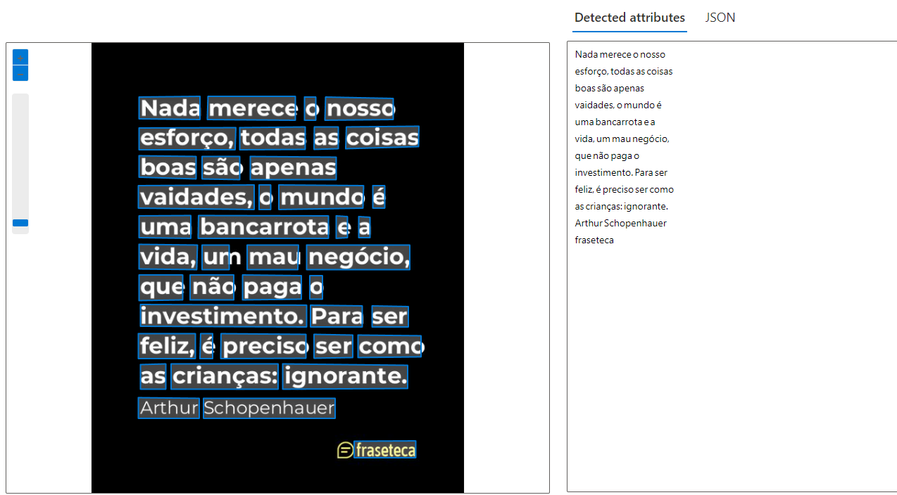

# Experimento com Detector de Texto do Azure Vision Studio

## Resumo do Experimento

Este experimento demonstra a utilização do detector de texto do Azure Vision Studio, uma ferramenta poderosa para extrair texto de imagens usando capacidades avançadas de visão computacional fornecidas pelo Azure Cognitive Services.

## Introdução

O objetivo deste experimento é explorar e avaliar o desempenho do detector de texto do Azure Vision Studio em diferentes tipos de imagens, incluindo documentos digitalizados, placas, e interfaces de usuário. Este experimento oferece insights sobre as capacidades de processamento de imagem do Azure e como elas podem ser aplicadas para automatizar a extração de texto em diversos cenários. Gostaria de agradecer pela DIO por disponibilizar os materiais e os conteúdos para elaborar este laboratório.

## Etapas do Experimento

### 1. Configuração do Ambiente
- **Acesso ao Azure Vision Studio**:
  - Login no Azure Portal e acesso ao Azure Vision Studio.
  - Criação de um recurso de Cognitive Services, se necessário.

### 2. Utilização do Detector de Texto
- **Execução do Detector de Texto em Imagens**:
  - Seleção de imagens de teste de diferentes fontes e formatos.
  - Carregamento das imagens no Azure Vision Studio e execução do detector de texto.

### 3. Análise dos Resultados
- **Avaliação do Desempenho do Detector**:
  - Observação da precisão da extração de texto em diferentes cenários.
  - Comparação dos resultados em imagens com diferentes níveis de complexidade.

### Imagens e Validação

Aqui estão alguns prints que descrevem o processo e validam os resultados obtidos:

## Insights e Possibilidades

Durante o experimento, foi possível observar que o detector de texto do Azure Vision Studio é altamente eficaz em uma ampla gama de imagens. Alguns insights incluem:

- **Alta Precisão em Textos Claros**: O detector funciona excepcionalmente bem em imagens com texto claro e bem definido.
- **Desafios em Textos com Fundo Complexo**: Algumas dificuldades foram notadas ao extrair texto de imagens com fundos complexos ou texto sobreposto em imagens com muitos detalhes.
- **Potencial para Automatização de Processos**: A capacidade de extrair texto automaticamente de imagens abre diversas possibilidades para automatização de processos em setores como jurídico, financeiro e educacional.
